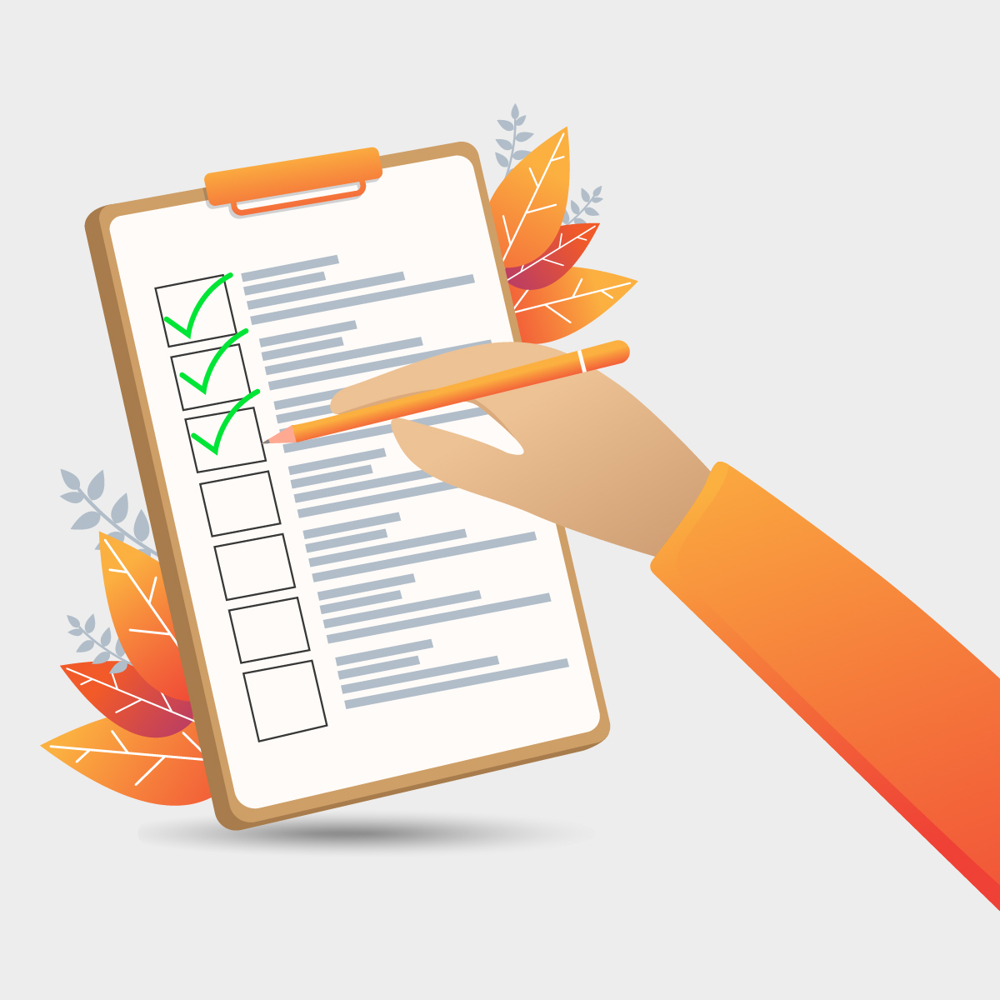

# Phase Anwenden - Erste Schritte 

<a href="https://www.vecteezy.com/vector-art/1222315-hand-holding-pencil-on-checklist">hand-holding-pencil-on-checklist Vectors by Vecteezy</a>

 

>Ziel: Nach Anleitung und unter Zuhilfenahme unseres [CheatSheets](cheatSheet/cheatsheet.pdf) erstellen Sie erste Inhalte mit LiaScript.

>Zeit: 20 Minuten

 

__Arbeitsschritte:__

1. Öffnen Sie den Live-Editor: [https://liascript.github.io/LiveEditor](https://liascript.github.io/LiveEditor)
2. Jetzt können Sie direkt loslegen. Versuchen Sie als erstes eine Überschrift zu generieren. Schauen Sie sich das Ergebnis im "Preview" an. Fügen Sie dann etwas Text ein und trennen Sie zwei Textteile durch einen Absatz. Aktualisieren Sie den Preview mit "Compile". 

    _Sie haben bereits Ihre erstes Material erstellt, das ging schnell, oder?_

3. Fügen Sie nun eine weitere Überschrift hinzu. Was passiert im Preview?
4. Stellen Sie nun das Lernmaterial, dass Sie erstellen, auf der zweiten Seite kurz vor! Bauen Sie dafür einen Text mit Aufzählung oder ein anderes Inhaltselement Ihrer Wahl ein.
5. Versuchen Sie diese Seite mit Hervorhebungen visuell zu strukturieren. 
6. Zum Abschluss soll es noch um ein paar spezifischere Funktionalitäten gehen. Generieren Sie eine neue Seite und fügen Sie eine Tabelle und ein Quiz Ihrer Wahl ein. 
7. Sie haben noch Zeit? Probieren Sie andere Funktionalitäten aus, die sich interessant anhören! Finden Sie z.B. heraus, wie der "Graph" funktioniert? 

---
💡
Sie brauchen Unterstützung? Wenn Sie auf die nächste Seite klicken, können Sie sich anzeigen lassen, wo Sie für die einzelnen Aufgabenschritt auf dem "CheatSheet" Lösungen finden! 
 
{{1}}
>**Hilfe zur Umsetzung**
>
>[Download CheatSheet](https://raw.githubusercontent.com/anja-schulz-dhs/>LiaWorkshop_HDS-eSALSA/main/cheatSheet/cheatsheet.pdf)
>
>- Aufgabenschritt 2: M2-M3
>- Aufgabenschritt 4: M4
>- Aufgabenschritt 5: M1, M10
>- Aufgabenschritt 6: M5, L6-L8

>Bei Fragen melden Sie sich jederzeit gern im Zoom-Raum bei uns!

---
