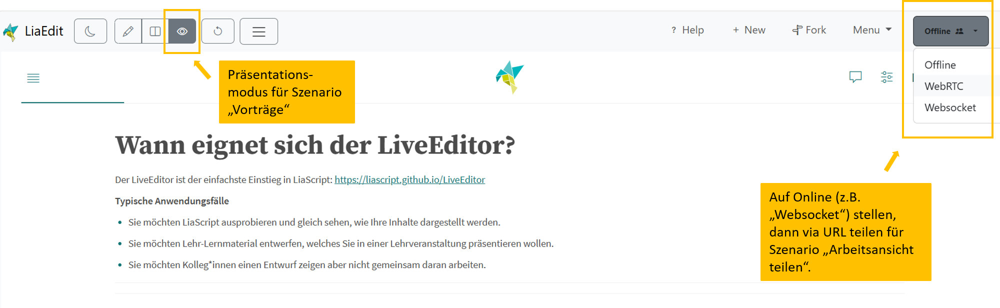

<!--
author:   Anja Hawlitschek und Anja Schulz

email:    anja.hawlitschek@ovgu.de

version:  0.1.0

language: de

narrator: Deutsch Male

mode:     Presentation

date:     08/06/2026

comment:  Zusatzmaterial des Workshops "Lehre interaktiv gestalten mit LiaScript" (09.06.2026).

attribute: "Entscheidungshilfe für LiaScript-Nutzende: LiveEditor versus Git-Repository""
           von Anja Hawlitschek und Anja Schulz
           ist lizenziert unter [CC BY-SA 4.0](https://creativecommons.org/licenses/by-sa/4.0/)

-->

# Entscheidungshilfe für LiaScript-Einsteiger*innen: LiveEditor versus Git-Repository

> Diese Anleitung hilft Ihnen bei der Entscheidung, ob Sie den LiveEditor oder eine Git-basierte Plattform (z.B. GitHub oder GitLab) für Ihr Vorhaben nutzen sollten.

| Wenn Sie ... wollen.   | Nutzen Sie ... |
|------------------------|----------------|
| LiaScript kennenlernen | LiveEditor |
| eine Präsentation erstellen und zeigen | LiveEditor |
| gemeinsam mit Kolleg*innen Materialien entwickeln | Git-Repository |
| Materialien langfristig pflegen | Git-Repository |
| Selbstlernmaterialien bereitstellen | Git-Repository |

---

## Wann eignet sich der LiveEditor?

Der LiveEditor ist der einfachste Einstieg in LiaScript: [https://liascript.github.io/LiveEditor](https://liascript.github.io/LiveEditor)

__Typische Anwendungsfälle__

- Sie möchten LiaScript ausprobieren und gleich sehen, wie Ihre Inhalte dargestellt werden.
- Sie möchten Lehr-Lernmaterial entwerfen, welches Sie in einer Lehrveranstaltung präsentieren wollen (Szenario "Vorträge").
- Sie möchten Kolleg*innen einen Entwurf zeigen aber nicht gemeinsam daran arbeiten (Szenario "Arbeitsansicht teilen").

---

## Wann eignet sich eine Git-basierte Plattform?

Plattformen wie GitHub oder GitLab sind für nichtinformatikaffine Menschen etwas gewöhnungsbedürftig. Ein Git-Repository ist jedoch unerlässlich, wenn Sie mehr wollen als der LiveEditor momentan ermöglicht.

__Typische Anwendungsfälle__

- Entwicklung im Team
- Bereitstellung für Studierende
- langfristige Nutzung und Notwendigkeit der Versionsverwaltung

__So gehen Sie vor:__ 
> Keine Panik: Mit Unterstützung durch KI schaffen Sie das selbst dann, wenn Ihre einzige Lösung für Computerprobleme sonst "Neustart" ist (funktioniert ja auch meistens)! 

1. Erstellen Sie ein Repository, z.B. auf GitHub.
2. Laden Sie die Inhalte aus dem LiveEditor als .zip runter (unter "Menu") und in Ihrem Repository wieder hoch.
3.  Verlinken Sie ggf. Medien neu.
4. Stellen Sie das Repository auf "public". 
5. Gehen Sie auf Ihre Markdown-Datei im Repository. Klicken Sie auf "Raw". Kopieren Sie die Raw-URL. Fügen Sie diese unter [https://liascript.github.io/](https://liascript.github.io/) ein und gehen Sie auf "Open Course". Voila, Ihr LiaScript-Kurs ist fertig! Natürlich sollten Sie nun nochmal alles prüfen und ggf. anpassen, falls sich Fehler eingeschlichen haben (Das Bearbeiten einer Datei in GitHub können Sie mit dem kleinen Stift-Symbol aktivieren!). Wenn Sie etwas im Repository verändern, müssen Sie lediglich die Seite Ihres LiaScript-Kurses aktualisieren. 

---
# Weitere Materialien
Kurze Anleitungen zu verschiedenen Funktionalitäten von LiaScript finden Sie unten auf der Webseite: [https://liascript.github.io/](https://liascript.github.io/)
