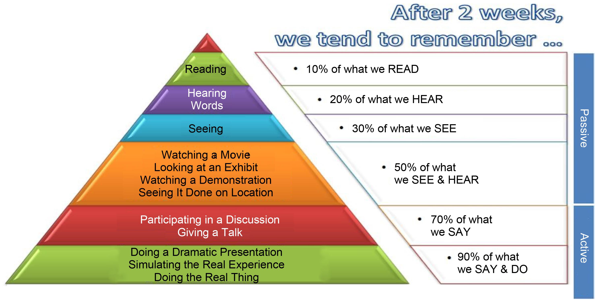

<!--
language: de
-->

# Gestaltung lernwirksamer Lehr-Lernaktivitäten und Lehr-Lernmaterialien

# Einführung

Dieses Selbstlernangebot ist Bestandteil des Online-Workshops "Lehre aktivierend gestalten mit LiaScript. Wie interaktive Lehr-Lernmaterialien einfach erstellt, mit Studierenden und Lehrenden aus aller Welt geteilt und kollaborativ bearbeitet werden können".

| __Inhaltliche Schwerpunkte__ | __Zeitbedarf__ |
| -------- | ------ | ------- |
| Grundlagen der lernwirksamen Gestaltung von Input- und Selbstlernphasen & Gestaltungsprinzipien für aktivierende Lehr- und Lernmaterialien | Planen Sie etwa 90 Minuten für die Rezeption der Inhalte und die kleinen Aufgaben ein. |

__Lernziele__

Durch die Bearbeitung des Selbstlernangebots nehmen Sie selbst die Lernendenperspektive ein und können daraus Erkenntnisse für die Gestaltung Ihrer eigenen Lehre bzw. Ihrer eigenen Lehr- und Lernmaterialien gewinnen. Entsprechend können Sie nach dem Durcharbeiten dieses asynchronen Workshopteils:

* Kriterien für gelungene Input- und Selbstlernphasen auf die eigene Lehre beziehen.
* Ausgehend von grundlegenden Prinzipien der Gestaltung aktivierender Lehr-Lernmaterialien konkrete Anpassungsbedarfe für die Materialien in Ihrer eigenen Lehre ableiten.
  

__Kontaktinfos__

Kontaktieren Sie uns gerne bei inhaltlichen Fragen oder Anmerkungen: [Anja Hawlitschek](mailto:anja.hawlitschek@ovgu.de) oder [Anja Schulz](mailto:anja.schulz@hd-sachsen.de). Für Fragen zu LiaScript wenden Sie sich bitte an [Sebastian Zug](mailto:Sebastian.Zug@informatik.tu-freiberg.de).

>Wir wünschen Ihnen viel Freude mit dem Selbstlernmaterial und freuen uns auf den Austausch mit Ihnen!

---
# Einstieg: Warum ist das Thema so wichtig?

„Studierende bereiten sich nicht vor“, „Studierende nutzen bereitgestellte Materialien nicht“, „Studierende kommen nicht in die Vorlesung“, „Studierende sind in Inputphasen passiv“, „Studierende beschäftigen sich während der Lehrveranstaltung mit anderen Dingen“ oder „Studierende haben Schwierigkeiten, Inhalte selbstständig zu vertiefen“ – viele Lehrende kennen solche Situationen aus ihrem Lehralltag.

Diese Beobachtungen sind keineswegs auf einzelne Lehrveranstaltungen oder Lehrpersonen beschränkt. Studien zur Hochschullehre zeigen beispielsweise, dass die Aktivierung von Studierenden in Lehrveranstaltungen nicht nur eine Herausforderung für Lehrende darstellt, sondern dass Studierende Lehre, in denen aktivierende Methoden genutzt werden teilweise als weniger lernwirksam wahrnehmen, als Lehre ohne Aktivierung (vgl. Carpenter, Witherby & Tauber, 2020). Die Frage, warum Lernprozesse manchmal nicht so gelingen wie erhofft, lässt sich nicht auf einfache Erklärungen reduzieren. Weder sind mangelnde Motivation oder „die heutige Studierendengeneration“ allein verantwortlich, noch hängt Lernerfolg ausschließlich von der Lehrperson ab. Forschungsergebnisse der Lehr-Lernforschung zeigen jedoch, dass die Gestaltung von Lehre trotz aller Herausforderungen einen relevanten Einfluss darauf hat, wie intensiv sich Lernende mit Inhalten auseinandersetzen und wie erfolgreich Lernprozesse verlaufen (Schneider & Preckel, 2017).

Wie können Lehr-Lernprozesse also so gestaltet werden, dass Lernen möglichst gut unterstützt wird?  Damit wollen wir uns im Folgenden beschäftigen.

__Stellen Sie sich einmal selbst folgende Frage:__

>Wodurch werden die Lernprozesse Ihrer Studierenden in Inputphasen in der Präsenzlehre sowie in Selbstlernphasen außerhalb des Hörsaals aus Ihrer Sicht besonders gut unterstützt?

Notieren Sie Ihre Antworten stichpunktartig auf einem analogen oder digitalen "Stück Papier". In den folgenden Kapiteln geben wir Ihnen einen Überblick dazu, welche Antworten zu dieser Frage die Wissenschaft hat.

Überlegen Sie beim Durcharbeiten:

- Wo stimmen Ihre Perspektiven mit denen, die im Kurs behandelt werden, überein?
- Wo gibt es Unterschiede?

---

# Grundlegendes zu lernförderlicher Gestaltung von Lehre

Zum Einstieg: Überlegen Sie einmal für sich, welches aus Ihrer Sicht relevante Faktoren sind, um den Lernerfolg Ihrer Studierenden zu fördern und welche so nicht zutreffen!

- [ ] Inputs dürfen nicht länger als 10 bis 15 Minuten sein, um die Aufmerksamkeitsspanne nicht zu überschreiten
- [ ] in Inputphasen sollten aktivierende Elemente integriert werden
- [ ] Ziele von Lernaktivitäten sollten klar kommuniziert werden
- [ ] Studierende merken sich Inhalte aus Vorträgen besonders schlecht, viel besser ist es, wenn sie Dinge tun können
- [ ] die Aktivierung des Vorwissens unterstützt Studierende bei der kognitiven Verarbeitung
- [ ] je nach Vorwissen benötigen Studierende unterschiedlich viel didaktische Unterstützung

> Die Auflösung finden Sie im folgenden Abschnitt!

---

## Gestaltung lernwirksamer Lernaktivitäten

Bitte schauen Sie sich die folgende Grafik aus einem Artikel von Shaaruddin & Mohamad (2017) an.

Wie Sie sehen, werden aktive und passive Formen des Lernens unterschieden und sind jeweils mit Prozentangaben zum Erinnern der Inhalte versehen.

Personen, die eine passive Aktivität ausführen, wie z.B. einen Text zu lesen, erinnern sich demnach deutlich schlechter an Inhalte als Personen, die aktiv tätig sind und z.B. an einer Diskussion teilnehmen.

Überlegen Sie einmal selber:

Deckt sich das mit Ihren Erfahrungen bezüglich Ihres eigenen Lernens?

Diese Darstellung trifft man in dieser oder leicht abgewandelter Form häufig in Büchern und Texten über lernwirksames Lehren. Intuitiv klingt das im ersten Moment sehr einleuchtend. Denkt man etwas intensiver darüber nach, fängt man zunehmend an zu zweifeln, ob sich solche pauschalen Aussagen über das Lernen als reliabel erweisen. Zwei der Aussagen aus der Grafik sollen im Folgenden mit Erkenntnissen aus wissenschaftlichen Studien der Lehr-Lern-Forschung kontrastiert werden.

__Frage 1: Werden gehörte Texte wirklich besser erinnert als gelesene?__

Antwort: Diese Aussage lässt sich so pauschal nicht halten, da dieser Effekt (auch als Modalitätseffekt bekannt) nur unter bestimmten Bedingungen auftritt:
Wenn Lernende mit einer Kombination aus visuellem Material (z. B. einer Grafik) und Text lernen sollen, führt eine Kombination aus Grafik und Audio zu einem besseren Lernerfolg als die Kombination aus derselben Grafik und geschriebenem Text (Ginns, 2005). Dies gilt jedoch nicht für lange oder sehr komplexe Texte. Diese werden besser erinnert und verstanden, wenn sie dem Lernenden nicht auditiv, sondern als geschriebener Text zur Verfügung gestellt werden (vgl. Leahy & Sweller, 2016).

---

__Frage 2: Die untere Ebene in der Darstellung („Simulation the Real Experience“, „Doing the Real Thing“) korrespondiert eng mit konstruktivistischen sowie handlungsorientierten Ansätzen des Lehrens und Lernens, wie etwa dem entdeckenden Lernen. Sind diese für den Lernerfolg wirklich besser als das vermeintlich passive Lernen während der direkten Instruktion (z.B. durch einen Vortrag)?__

Antwort: Die Ergebnisse von Studien deuten darauf hin, dass die didaktische Unterstützung der Lernenden entscheidenden Anteil für den Erfolg oder Misserfolg von Lernprozessen hat. In einer Meta-Analyse konnten Alfieri, Brooks, Aldrich & Tenenbaum (2011) z.B. zeigen, dass Formen des entdeckenden Lernens ohne didaktische Unterstützung in der Regel weniger Lernerfolg nach sich ziehen als direkte Instruktion. Besonders effektiv sind Lernprozesse immer dann, wenn handlungsorientierte Formen des Lernens um didaktische Anleitung und Unterstützung der Lernenden ergänzt werden.

__Fazit für die Lehre__

Die Dichotomie von passiven Lernenden, die mit Texten, Vorträgen oder Videos lernen versus aktiven Lernenden, die mit handlungsorientierten Methoden lernen, führt in die Irre. Der Kognitionspsychologe Richard E. Mayer hat es einmal wie folgt auf den Punkt gebracht:

“Activity may help promote meaningful learning, but instead of behavioral activity per se (e.g., hands-on activity, discussion, and free exploration), the kind of activity that really promotes meaningful learning is cognitive activity (e.g., selecting, organizing, and integrating knowledge).” (Mayer, 2004, S. 17)

---

> Entscheidend ist nicht, wie aktiv Lernende äußerlich sind, sondern wie aktiv und tiefgehend sie Inhalte kognitiv verarbeiten. Dabei gibt es nicht DIE Methode oder DAS Format – diese müssen zu den Lernzielen, den Lernenden und zu Ihnen als Lehrperson passen![^1]

---

[^1] Und woher kommt der „Cone of Experience“ nun eigentlich?
Der „Cone of Experience“ oder auch „Cone of Learning“ geht auf eine Visualisierung der unterschiedlichen Arten des Lernens mit Medien von Dale (1946/1969) zurück, so wie die Abbildungsunterschrift in der Publikation von Shaaruddin & Mohamad (2017) auch suggeriert. Dale (1946) visualisiert in der ursprünglichen Grafik jedoch lediglich den Abstraktionsgrad von Lernerfahrungen, ohne davon auf das Behalten von Lerninhalten zu schließen. Auf welchem Weg die ursprüngliche Visualisierung zu einer Art pädagogischen Anleitung und damit zu einem Lernmythos geworden ist, lässt sich heute kaum noch rekonstruieren.

---

## Gestaltung lernwirksamer Lernaktivitäten – jetzt aber wirklich

Im Folgenden stellen wir auf der Basis der Ergebnisse eines systematischen Reviews von Metaanalysen (Schneider & Preckel, 2017) relevante Einflussfaktoren für Lernerfolg in der hochschulischen Bildung vor. Auf Studierendencharakteristika, die einen großen Einfluss auf den Lernerfolg haben, gehen wir hierbei nicht vertiefend ein. Genannt sollen diese aber zumindest einmal werden: Besonders wirksam sind: 
- motivationale Variablen, wie Selbstwirksamkeitserwartungen und selbst gesetzte Lernziele, 
- kognitive Variablen wie Vorwissen und Intelligenz sowie 
- Kompetenzen in der Anwendung von Lernstrategien, z.B. die Regulation der mentalen Anstrengung in Abhängigkeit der Lernaufgabe oder das Zeitmanagement.

Wir fokussieren jedoch in diesem Kurs auf Variablen, die Lehrende gezielt beeinflussen können. Die im Text angegebenen Ränge beziehen sich auf die 138 in den Meta-Analysen untersuchten Variablen, die Schneider & Preckel nach ihren Effektstärken gerankt haben.

Auf den nächsten Seiten finden Sie die wichtigsten Tipps:

---

### (1) Investieren Sie Zeit in die didaktische Planung und Organisation Ihrer Lehrveranstaltungen!

Uns ist natürlich bewusst, dass die zeitlichen Kapazitäten für die Lehre begrenzt sind aber wir wollen hier dennoch zentral darauf hinweisen, dass hier ein starker empirischer Zusammenhang besteht: Von allen in der Meta-Analyse untersuchten Variablen, die Lehrende direkt beeinflussen können, ist die Zeit und Anstrengung, die Lehrende für die didaktische Planung und Organisation investieren die Variable mit der größten Wirkung auf den Lernerfolg. 

_Unser Tipp zur Vertiefung: Wenn Sie wenig Erfahrung mit der didaktischen Planung von Lehrveranstaltungen haben, nutzen Sie auch gerne unseren kostenfreien Selbstlernkurs "Lehrveranstaltungen planen. Ein praxisorientierter Grundkurs" um eine Lehrveranstaltung von Grund auf didaktisch zu planen (Zeitbedarf: ca. 135 Minuten Rezeption und 225 Minuten Bearbeitung Transferaufgaben (= 8 AE)). Zugänglich nach Anmeldung (kostenfrei) im Weiterbildungs-ILIAS der Hochschule Merseburg:_ [https://weiterbildung.hs-merseburg.de/ilias.php?baseClass=ilrepositorygui&ref_id=538](https://weiterbildung.hs-merseburg.de/ilias.php?baseClass=ilrepositorygui&ref_id=538) 

> Übrigens: Ihr Enthusiasmus als Lehrperson in Bezug auf die Lehrveranstaltung und/oder die Inhalte trägt auch zum Lernerfolg bei (Rang 23).

### (2) Kombinieren Sie instruktionsorientierte und handlungsorientierte Lehr-Lernformen
Eine Kombination von lehrendenzentrierten bzw. instruktionsorientierten Formen der Lehre (z.B. Vorträge) und studierendenzentrierten bzw. handlungsorientierten Formen (z.B. Gruppenarbeiten oder Projektarbeiten) hat eine stärkere Wirkung auf den Lernerfolg als eine Form der Instruktion alleine. Instruktionsorientierte Lehr-Lernformen sind effektiv, wenn sie die Lernenden motivieren und durch aktivierende Methoden angereichert werden (vgl. Punkt 5). Stärker handlungsorientierte Lehr-Lernformen sind effektiv, wenn sie durch Lehrende didaktisch angeleitet und begleitet werden.

### (3) Teilnahme der Studierenden
Sie haben sich sicherlich schon häufig über fehlende Studierende in Ihren Lehrveranstaltungen geärgert oder gegrämt. Ihr professionelles Wissen, dass das ein wichtiger Aspekt für den Lernerfolg ist, wird auch durch empirische Studien bestätigt! 

> Machen Sie Ihren Studierenden deutlich, dass "frequent class attendance" die Variable mit dem stärksten Zusammenhang mit Lernerfolg ist (Rang 6), die von den Studierenden direkt beeinflusst werden kann (vgl. Schneider & Preckel, 2017, S. 26)! 

### (4) Kognitive Belastung an Lernendenvoraussetzungen anpassen

Warum ist es wichtig, die kognitive Belastung der Lernenden an Lernendenvoraussetzungen anzupassen?

Bevor Informationen in das Langzeitgedächtnis kommen, müssen sie im Arbeitsgedächtnis verarbeitet werden. Die Verarbeitungskapazität des menschlichen Arbeitsgedächtnisses ist begrenzt. Lernen wird erschwert, wenn Lernende zu viele Informationen gleichzeitig verarbeiten müssen oder mit lernirrelevanten Verarbeitungsprozessen belastet werden (z.B. bei der Navigation durch eine unübersichtliche Lernumgebung). Lernaktivitäten, Aufgaben und Lernumgebungen sollten deshalb so gestaltet werden, dass verfügbare kognitive Ressourcen optimal für lernrelevante Verarbeitung genutzt werden können und Lernende weder über- noch unterfordert werden (Sweller, Ayres & Kalyuga, 2011). Daher benötigen auch nicht alle Lernenden gleich viel didaktische Unterstützung: 

> Lernende mit wenig Vorwissen profitieren stärker von Strukturierung und Anleitung, für fortgeschrittene Lernende ist diese nicht im gleichen Maße notwendig, teilweise sogar kontraproduktiv (Kalyuga & Renkl, 2010).

Und wie kann man die Komplexität von Aufgaben und Inhalten gut anpassen? Einige Beispiele: 
- Beispielhafte Schritt-für-Schritt-Lösungen (Worked-Examples) zur Unterstützung des Problemlösens (Paas & Van Gog, 2006). Erläuterung: Problemlöseaufgaben sind kognitiv sehr anspruchsvoll. Lernende mit wenig Vorwissen lernen deswegen besonders gut, wenn sie zunächst mit ausgearbeiteten Worked-Examples in das Problemlösen starten und sich auf das Verstehen der zugrunde liegenden Konzepte konzentrieren können. Im nächsten Schritt können sie das Vorgehen dann auf neue Aufgaben des gleichen Typs transferieren. Für Lernende mit viel Vorwissen sind schrittweise Lösungsanleitung dagegen redundant, für sie ist eigenständiges Arbeiten ohne Worked Examples lernwirksamer.
- Inhalte segmentieren: Komplexe Inhalte in kleinere Verarbeitungseinheiten aufteilen (Rey et al., 2019). Erläuterung: Die Designempfehlung betrifft die Segmentierung von Lerninhalten. Durch eine Einteilung von Lerninhalten in kleinere Segmente, die die Lernenden selbstgesteuert bearbeiten können, wird es diesen ermöglicht, zunächst Teilaspekte des Lerninhalts zu verarbeiten. Erst in einem zweiten Schritt werden diese dann integriert. Auf diese Weise wird die Anzahl von Informationen deutlich kleiner, die der Lernende gleichzeitig im Arbeitsgedächtnis behalten und verarbeiten muss und somit die Komplexität reduziert. 
- Hervorheben relevanter Elemente des Lehr-Lern-Materials (Schneider et al., 2018). Um die Lernenden bei der Aufmerksamkeitssteuerung zu unterstützen und die kognitive Belastung durch die Verarbeitung lernirrelevanter Details zu minimieren, werden häufig Methoden des "Signalings" oder "Cueings" genutzt. Beispiele für Signaling sind die farbige Hervorhebung von Schlüsselwörtern in einem Text oder Schlüsselprozessen in einer Grafik oder die Nutzung von Pfeilen, um auf bestimmte Aspekte hinzuweisen.

---

### (5) Kleine Änderungen große Wirkung

Schon mit kleinen Änderungen auf der Mikroebene des Lehrens können Sie große Wirkung erzielen. Die Wirkung von Lehr-Lernmethoden hängt jedoch davon ab, ob sie zu den Lernzielen, den Studierenden und nicht zuletzt zu Ihnen als Lehrperson passen. Wir haben für Sie auf den folgenden Seiten auf der Basis der Ergebnisse von Schneider & Preckel (2017) Tipps zu kleinen (und einigen wenigen größeren) Änderungen zusammengestellt.

---

#### (5.1) Lernende kognitiv (!) aktivieren:
- Fragen und Diskussionen anregen (Rang 11). 
- Offen formulierte Fragen an die Studierenden regen zur elaborierten Verarbeitung von Inhalten an, z.B.: „Wie bewerten Sie ..." (Rang 16)
- Lernen in Kleingruppen (2-4 Studierende) ist lernwirksamer als Einzellernen oder Lernen in großen Gruppen (Rang 27). Aber Achtung: didaktische Anleitung wichtig!
- Studierende Concept Maps zentraler Ideen, Konzepte, Vorgehensweisen konstruieren und diskutieren lassen (Rang 45).

_Unser Tipp zur Durchführung: Gruppenarbeiten sind für Studierende mit wenig Vorerfahrung in der Gruppenarbeit herausfordernd. Das Team muss sich koordinieren und regulieren. Probleme entstehen z.B. häufig aufgrund von mangelndem Engagement von Teammitgliedern. Wir haben gute Erfahrungen mit der didaktische Anleitung von Gruppenarbeit mittels Kollaborationsskripten gemacht, d.h. Anleitungen, wie die Teammitglieder miteinander interagieren und zusammenarbeiten sollen (z.B. Verteilen von Rollen und Zuständigkeiten) und wie der Ablauf der Zusammenarbeit aussehen soll (vgl. Hawlitschek, Rudolf & Zug, 2022)._

---
#### (5.2) Meaningful learning ermöglichen/fördern:
Meaningful Learning (bitte melden Sie sich, wenn Ihnen eine gute deutsche Übersetzung bekannt ist) bedeutet, dass den Lernenden die Relevanz und der Mehrwert von Lerninhalten und Lernaktivitäten bewusst ist und sie diese in Bezug zu ihren eigenen Erfahrungen und ihrem eigenen Vorwissen setzen können. Dies hat positive Effekte auf Motivation, Interesse und Lernerfolg (Schneider & Preckel, 2017). 
- Klare Lernziele and Erfolgskriterien für den Kurs kommunizieren (Rang 13). 
- Die Bedeutsamkeit des Inhalt für die Studierenden deutlich machen (Rang 17). Dafür können Sie Lerninhalte mit authentischen Problemen, Praxisbeispielen oder beruflichen Anwendungskontexten verknüpfen sowie Lernende reflektieren lassen, welche Bedeutung die Inhalte für eigene Erfahrungen, Interessen oder berufliche Ziele haben.
- Jede thematische Einheit mit einem Advance Organizer beginnen (Rang 64).

_Unser Tipp: _

---
#### (5.3) Wissensüberprüfung und Feedback:
Feedback gehört zu den wirksamsten Einflussfaktoren auf Lernen. Lernende profitieren davon, Rückmeldung darüber zu erhalten: was sie bereits verstanden haben und wie sie ihren Lernprozess verbessern können. Doch die Wirkung auf den Lernerfolg hängt stark von der Forms des Feedbacks ab. Verallgemeinert kann festgehalten werden: Je mehr Inhalt ein Feedback enthält, desto lernwirksamer ist es (Wisniewski, Zierer & Hattie, 2020). 
- Regelmäßige Selbsttests/Tests zur Überprüfung des eigenen Wissens durchführen/bereitstellen (Rang 69).
- Feedback geben, dass detailliert und aufgabenorientiert ist und Verbesserungsmöglichkeiten für die Studierenden aufzeigt (Rang 30). 
- Eine Wissensüberprüfung vor Einführung von neuem Stoff durchführen (Rang 25).

_Unser Tipp zur Umsetzung: Eine Möglichkeit schnell und niedrigschwellig zur Reflexion über den eigenen Wissensstand anzuregen und dies zum Ausgangspunkt der nächsten Lehrveranstaltung zu nehmen, sind 2-Minuten-Lerntagebücher. Hier bekommen die Studierenden am Ende jedes Kurses zwei Minuten Zeit, um anonym in einem digitalen Tool aufzuschreiben, was sie in dem Kurs gerlernt haben, was sie noch nicht verstanden haben und wo sie sich Unterstützung wünschen. Die Lehrperson liest sich die Beiträge durch und greift diese zu Beginn jedes Kurses auf, um Wissenslücken zu schließen und auf Bedarfe zur Unterstützung einzugehen (vgl. Köppen & Hawlitschek, 2025)._ 

---
#### (5.4) Lehr-Lernmaterialien und Input:
- Inhalte verständlich formulieren (Rang 4), z.B. Fachbegriffe für Lernende mit wenig Vorwissen zunächst einordnen und erläutern. 
- Das Interesse der Studierenden wecken (Rang 9), z.B. durch Storytelling oder der Anregung von Inkongruenzerfahrungen (wenn vorhandene Erfahrungen nicht mit den Lerninhalten übereinstimmen).
- Lernende mit einer Kombination aus gesprochenem Text und visuellem Material (z. B. Folien mit Grafiken) lernen lassen (Rang 42), allerdings dürfen die Inhalte nicht redundant sein (Ginns, 2005). 
- Auf Präsentationsfolien: Anstriche (bullet points) anstelle von ganzen Sätzen nutzen (Redundanzproblem, siehe oben!) und dekorative aber ablenkende Inhalte vermeiden (Rang 101).

_Unser Tipp zur Vertiefung: Gute Präsentationen zu gestalten, ist eine Herausforderungen. Nutzen Sie gerne unseren kostenfreien Selbstlernkurs "Präsentationen lernwirksam gestalten", wenn Sie sich mit der Thematik vertiefend beschäftigen wollen (Zeitbedarf: 90 Minuten Rezeption (= 2 AE). Zugänglich nach Anmeldung (kostenfrei) im Weiterbildungs-ILIAS der Hochschule Merseburg: _[https://weiterbildung.hs-merseburg.de/ilias.php?baseClass=ilrepositorygui&ref_id=333](https://weiterbildung.hs-merseburg.de/ilias.php?baseClass=ilrepositorygui&ref_id=333) 

---
#### (5.5) Interaktion mit Studierenden:
- Inwieweit die Lehrperson als erreichbar und hilfreich wahrgenommen wird, hat Einfluss auf den Lernerfolg der Studierenden (Rang 11). Dies lässt sich z.B. durch verlässliche Sprechzeiten und die Kommunikation von Rückmeldezeiten bei Anfragen beeinflussen.
- Ebenso wichtig ist, inwiefern der Umgang mit den Studierenden als freundlich und respektvoll wahrgenommen wird (Rang 30).

_Unser Tipp zur Vertiefung: Grade in der Online-Lehre und in Selbstlernphasen ist es mitunter schwer, eine stabile Arbeitsbeziehung zu den Studierenden herzustellen. Nutzen Sie gerne unseren kostenfreien Selbstlernkurs "Impulse zur Beziehungsgestaltung und emotionalen Sicherheit in der Online-Lehre (Zeitbedarf: ca. 45 Minuten Rezeption und 45 Minuten Bearbeitung Transferaufgaben (= 2 AE)), wenn Sie sich mit der Thematik vertiefend beschäftigen wollen. Zugänglich nach Anmeldung (kostenfrei) im Weiterbildungs-ILIAS der Hochschule Merseburg: _[https://weiterbildung.hs-merseburg.de/ilias.php?baseClass=ilrepositorygui&ref_id=679](https://weiterbildung.hs-merseburg.de/ilias.php?baseClass=ilrepositorygui&ref_id=679)  

## Quiz
Zum Abschluss dieses Kapitels dürfen Sie die Fragen vom Anfang nochmal als Quiz beantworten. 

Welches sind aus Ihrer Sicht relevante Faktoren, um den Lernerfolg Ihrer Studierenden zu fördern?
- [[ ]]Inputs dürfen nicht länger als 10 bis 15 Minuten sein, um die Aufmerksamkeitsspanne nicht zu überschreiten.
- [[X]]In Inputphasen sollten aktivierende Elemente integriert werden.
- [[X]]Ziele von Lernaktivitäten sollten klar kommuniziert werden.
- [[ ]]Studierende merken sich Inhalte aus Vorträgen besonders schlecht, besser für den Lernerfolg ist es, wenn sie Dinge tun können.
- [[X]]Die Aktivierung des Vorwissens unterstützt Studierende bei der kognitiven Verarbeitung.
- [[X]]Je nach Vorwissen benötigen Studierende unterschiedlich viel didaktische Unterstützung.
**************
Sehr gut, Sie haben die Lernmythen richtig identifiziert!
**************

---
# Und was gibt es zur lernwirksamem Gestaltung von Lehre noch zu sagen?

Denken Sie noch einmal an die Frage vom Anfang, wozu Sie sich Antworten auf einem "Stück Papier" notiert hatten:  Wodurch werden die Lernprozesse Ihrer Studierenden in Inputphasen in der Präsenzlehre sowie in Selbstlernphasen außerhalb des Hörsaals aus Ihrer Sicht besonders gut unterstützt?

Welche Ihrer Antworten würden Sie gerne mit den anderen Workshop-Teilnehmenden teilen, da sie hier nicht oder nicht ausreichend behandelt wurden?
Notieren Sie diese auf folgendem Edupad:
??[Edupad](https://edupad.ch/p/j0b0KyWopb)

---

# Gestaltung aktivierender Lehr-Lernmaterialien 

Sie wollen für Ihre Studierenden neue Lehr-Lern-Materialien erstellen oder bereits vorhandene überarbeiten? Wie Sie im vorhergehenden Abschnitt erfahren haben, ist eine gute didaktische Planung entscheidend dafür, ob Ihre Materialien lernwirksam, also kognitiv aktivierend, sind oder nicht.

Es existieren unterschiedlichste Modelle zur systematischen didaktischen Konzeption von Lernangeboten. Was viele dieser Modelle eint, ist, dass in einem ersten Schritt eine didaktische Analyse erfolgt (vgl. Niegemann et al., 2008), in deren Rahmen sich mit folgenden Fragen auseinandergesetzt werden sollte:

- Welche Lehr-Lernziele verfolgen Sie mit dem Material?
- Welchen Mehrwert hat das Lehr-Lernmaterial?
- Welche Charakteristika der Zielgruppe sollten Sie beachten?

Darüber hinaus müssen Sie im Rahmen des didaktischen Designs Ihrer Lehr-Lernmaterialien verschiedene Entscheidungen treffen, etwa zur Auswahl der Lerninhalte, zu Lernaktivitäten, zur Strukturierung der Inhalte, zur (multi-)medialen Gestaltung, zum Grafik- und Interaktionsdesign sowie zur Motivation und Aktivierung der Lernenden (Niegemann et al, 2008).

In diesem Abschnitt fokussieren wir auf wissenswerte Tipps aus der Lehr-Lernforschung, die bei der konkreten Gestaltung von Lehr-Lernmaterialien beachtet werden sollten. Ansprechend für die Lernenden ist hierbei der Einsatz von multimedialen Elementen bzw. ein gelungener Medienmix. Weniger ist hier allerdings oft mehr. Zu viele Angebote überfordern die Lernenden und bringen sie schnell an ihre Grenzen. Das richtige Maß ist gefragt.

---

## Designprinzipien für die Erstellung von Multimedia

Wie findet man nun aber dieses richtige Maß? Ein Exkurs in die Kognitionspsychologie bietet Orientierung und liefert wichtige Hinweise.

Sehen Sie sich das folgende Video zu grundlegenden Gestaltungsprinzipien von Multimedia an. Notieren Sie stichpunktartig die für Sie relevantesten Aspekte, die Sie bei der Erstellung Ihrer Lehr-Lernmaterialien berücksichtigen möchten!

!?[Video: Grundlegende Designprinzipien bei der Erstellung von Multimedia](https://vimeo.com/799090705?fl=pl&fe=cm)

---
## Prinzipien multimedialen Lernens: Quiz 

Wiederholung: Welches sind Prinzipien des multimedialen Lernens, die sich positiv auf den Lernerfolg auswirken (empirisch nachgewiesen)?

- [[X]]Personalisierungsprinzip: Sprechen Sie Ihre Lernenden im Material persönlich an.  
- [[X]]Modalitätsprinzip: Sprechen Sie verschiedene Sinneskanäle an, nutzen Sie z.B. Grafiken mit gesprochenen statt geschriebenen Erläuterungen. 
- [[X]]Redundanzprinzip: Präsentieren Sie keine redundanten Informationen, z.B. den gleichen Text als Ton und als schriftlichen Text. 
- [[X]]Split-Attention-Prinzip: Bringen Sie Informationselemente, die zusammengehören (z.B. eine Grafik und ein erläuternder Text), in größtmögliche zeitliche und räumliche Nähe.
- [[X]] Segmentierungs-Prinzip: Teilen Sie Lerninhalte in kleinere Segmente auf, die Lernende im eigenen Tempo bearbeiten können.
- [[X]]Kohärenzprinzip: Lassen Sie für das Verstehen nicht notwendige Töne, Bilder oder Texte weg.
**************
Sind Sie darüber gestolpert, dass im Quiz mit Pauschalisierungen gearbeitet wurde? Sie haben natürlich recht! Die Wirkung von solchen Prinzipien ist (wie teilweise auch schon in Abschnitt 1 behandelt) oft auch von den Rahmenbedingungen und dem Einsatzszenario abhängig, z.B. beim Modalitätsprinzip von der Länge und Komplexität von Texten, beim Segmentierungsprinzip von dem Vorwissen der Lernenden oder beim Redundanzprinzip davon, ob Lernende die Modalitäten auswählen können.
**************

---
Die nachfolgende Tabelle fasst die zentralen Prinzipien des multimedialen Lernens nach Mayer (2026) noch einmal überblicksartig zusammen:

| Prinzpien multimedialen Lernens | Erläuterung | Merksatz |
| -------- | ------ | ------- |
| Personalisierungsprinzip     |   Das Prinzip der individuellen Unterschiede oder Personalisierungsprinzip besagt, dass eine persönliche Ansprache sowie pädagogische Agenten das Lernen unterstützen können. Außerdem wirken Designeffekte bei geringem Vorwissen der Lernenden mehr, als bei hohem Vorwissen, da Lernende mit hohem Vorwissen imstande sind, ihr Vorwissen dazu zu gebrauchen, Mängel der Instruktionsqualität auszugleichen.   |     Lernende direkt ansprechen |
| Modalitätsprinzip | Behaltens- und Transferleistungen werden erhöht, wenn Grafiken und Animationen mit gesprochenen statt geschriebenen Erläuterungen dargeboten werden, da so der visuelle Kanal entlastet und die Information zeitgleich über beide Kanäle aufgenommen wird. Demnach ist der Einsatz eines gesprochenen Textes zur Erläuterung eines Bildes besser als ein geschriebener Text zu einem Bild. | verschiedene Sinneskanäle ansprechen |
| Redundanzprinzip | Die audiovisuelle Darstellung (z. B. Filme und Animationen) von Lerninhalten durch Bild und Ton ist effektiver als die redundante Präsentation der gleichen Information von Bild, Ton und schriftlichem Text. Ebenso ist die zeitgleiche Darbietung derselben Information durch gesprochenen und geschriebenen Text zu vermeiden. | Aufnahme- und Verarbeitungskapazitäten sind begrenzt |
| Multimediaprinzip | Die Darbietung des Lerninhalts mittels Kombination aus Texten und Bildern verspricht ebenfalls eine bessere Behaltens- und Transferleistung als die rein textuelle Informationspräsentation. Dies gilt vor allem bei Lernenden mit geringem Vorwissen. Wichtig ist, dass das Verbale dem Bildlichen inhaltlich entspricht. Verschiedene Medien ergänzen sich idealerweise bei der Vermittlung des Lerninhalts. | ein Bild sagt mehr als tausend Worte |
| Kontiguitätsprinzip | Bilder, Grafiken, Animationen etc. und erläuternde Texte sollten in größtmöglicher zeitlicher und räumlicher Nähe zueinander zu sehen sein. Ein positiver Effekt ergibt sich allerdings nur, wenn sich visuelle Präsentation und Text ergänzen und die dargestellte visuelle Information nicht selbsterklärend ist. | Zusammen, was zusammen gehört |		
| Kohärenzprinzip | Für das Verstehen nicht notwendige Töne, Bilder oder Texte sollten weggelassen werden, damit das Arbeitsgedächtnis nicht überbelastet, der Lernende nicht vom eigentlichen Lerninhalt abgelenkt und der Lernprozess auf diese Weise beeinträchtigt wird. | Weniger ist mehr |

DARAUS EIN QUIZ MACHEN?

---

## Tipps für die Gestaltung verschiedener Materialarten

In den folgenden Abschnitten haben wir Hinweise für die Gestaltung verschiedener Materialarten formuliert, welche die vorgestellten Designprinzipien berücksichtigen.

---

__(1) Textgestaltung__

Ein Text sollte vor allem einfach und prägnant sowie sinnvoll gegliedert werden, um für Lernende verständlich zu sein. Die Sätze sollten kurzgehalten und einfach strukturiert sein. Unnötige Darstellungen und lange, verschachtelte Sätze sollten in Ihrem Lernmaterial vermieden werden. Der Text sollte eine klare Gliederung beinhalten (Überschriften, Vorbemerkungen, Fazit und eine Zusammenfassung) und ein roter Faden sollte stets erkennbar sein. Unterstreichungen, Fettdruck und auch Nummerierungen dienen zum besseren Verständnis in schriftlich dargebotenem Lehr-Lernmaterial. Ein weiteres Merkmal ist die Kürze bzw. Prägnanz. Sie sollten versuchen, sich auf das Wesentliche zu beschränken, können jedoch ab und zu anregende Zusätze an Ihre Lernenden geben.

>Generell gilt: Versuchen Sie abwechslungsreiche Formulierungen, einen interessanten Schreibstil, die persönliche Ansprache und Texte unterlegt mit Illustrationen zu verwenden. Geben Sie Ihren Lernenden Beispiele mit, damit diese sich ein Bild vor Augen führen können. Elemente wie Zitate und Fragen sollten ebenfalls mit in den Text einfließen, um den Inhalt aufzulockern. Sprechen Sie Ihre Lernenden persönlich an oder fordern Sie sie durch einfache Aufgaben auch mal auf, sich im Lernmodul etwas genauer umzuschauen (vgl. Lischka, 2019).

---

__(2) Präsentationsfolien__

Präsentationsfolien eignen sich als Strukturierungshilfe und Visualisierungsmedium für Vorträge. Die wichtigste Überlegung, die Sie an den Anfang des Gestaltungsprozesses von Präsentationsfolien stellen sollten, ist die Frage, ob die Folien zur Begleitung eines Live-Vortrags gedacht sind oder ob Studierende mit der Präsentation im Nachgang selbständig lernen sollen. Folien zu erstellen, die für beide Ziele gleichzeitig optimal geeignet sind, ist nicht möglich. Dienen Ihre Folien zur Begleitung und Visualisierung von Lerninhalten in einer Vortragssituation, sollten Sie sich fragen, ob es dem Lernerfolg dient, wenn Studierende genau dieses oder jenes parallel zum Gehörten live mitlesen/ansehen/tun sollen.

Ein paar Merksätze:
- Nutzen Sie Schlüsselwörter und kurze Wortgruppen, keine ganzen Sätze (Krist, 2015).
- Nutzen Sie Bulletpoints bei Aufzählungen (Katt et al., 2008).
- Vermeiden Sie Redundanz - insbesondere: Lesen Sie Ihre Folien nicht vor (Rey, 2009).

Wollen Sie sich mit der Gestaltung von Folien vertiefend beschäftigen? Dann schauen Sie in folgenden Selbstlernkurs: https://weiterbildung.hs-merseburg.de/goto.php?target=crs_333&client_id=il_hsm_weiterbildung

---

__(4) Hörtexte__

Neben den klassischen Textelementen können auch Hörtexte eingesetzt werden, um das auditive Lernen zu verstärken. Beim Erstellen von Hörtexten sollten Sie für Ihre Lernenden anfangs eine kurze Einleitung in die behandelten Themen geben, z.B.: „Heute möchte ich Ihnen die wichtigsten Gestaltungsprinzipien von Lehr-Lernmaterialien vorstellen“. Folgenden Hinweise sollten Sie bei der Erstellung von Hörtexten innerhalb Ihrer Lernmaterialien beachten:

- Packen Sie nicht zu viel Inhalt in einen Hörtext. Die Länge sollte in der Regel 10 bis 20 Minuten nicht überschreiten (vgl. Cho et al., 2017).
- Authentizität und das Berichten persönlicher Erfahrungen/Anekdoten unterstützen den Lernerfolg (Downs et al., 2011; Cho et al., 2017).
- Studierende präferieren Hörtexte ihrer Lehrenden im Vergleich zu Studioaufnahmen fremder Personen (Taylor & Clark, 2010).

Mehr Informationen und viele praktive Übungen zur Erstellung von Hörtexten für die Lehre finden Sie in unserem Selbstlernkurs zur Podcasterstellung: https://weiterbildung.hs-merseburg.de/goto.php?target=crs_335&client_id=il_hsm_weiterbildung

---

__(5) Grafiken, Bilder und Animationen__

Grafiken sind bei der Erstellung Ihrer Lehr-Lernmaterialien ebenso unverzichtbar wie Texte. Dies können selbst erstellte Bilder, Fotos, Diagramme oder Zeichnungen sein. Grafiken sind besonders dafür gedacht, komplexe Informationen zu reduzieren und einfach dargestellt zu vermitteln. So wird bspw. die grafische Darstellung eines Tortendiagramms wesentlicher schneller erfasst, als eine Darstellung im Text. Grafiken lassen sich vor allem für den Aufbau und das Aussehen von Gegenständen, Systemen, Maschinen, aber auch bei abstrakten Verhältnissen verwenden. Bilder lockern auf und können den Lernenden informieren und dokumentieren, können aber auch Aufmerksamkeit auf bestimmte Sachverhalte erregen oder eine bestimmte Stimmung hervorheben. Animationen eignen sich vor allem für folgende Inhalte:

- Chronologische Prozesse (z. B. Wachstum, Abfolge von Einzelereignissen)
- Räumliche Darstellungen (z. B. durch das dreidimensionale Rotieren von Gegenständen)
- Handhabungsanleitungen
- Schritt-für-Schritt-Erläuterungen
- Vergrößerung – Verkleinerung
- Änderung von Hintergrundfarben, Lichtverhältnissen" (Lischka, 2019).

---

__(6) Videos__

Für Videos generell gelten ebenso die Punkte, die auch für Grafiken, Animationen und Hörtexte gelten, da sie eine Kombination aller vorher genannten Darstellungstypen sind. Der Fokus sollte vor allem auf der grafischen Komponente liegen, unterstützt durch einen Hörtext. Durch Töne, Bilder und Bewegungen bekommen Lernende einen schnellen Überblick über das behandelte Thema. Der geschriebene Text dient dabei eher als visueller Aufhänger. In Videos können im Vergleich zu den anderen Darstellungsformen komplexe Prozesse am besten visualisiert werden, die Produktion ist jedoch am aufwendigsten.

Berücksichtigen Sie:
- Lernende sollen die Möglichkeit haben, die Geschwindigkeit der Darbietung von Informationen in dem Video mit Funktionen wie Stopp und „Spulen“ selbst zu bestimmen und so ihr eigenen Lerntempo zu bestimmen (Fyfield, Henderson & Phillips, 2022).
- Videos sollten so aufbereitet sein, dass Lernende möglichst einfach auf relevante Informationen zugreifen können, z.B. durch inhaltliche und visuelle Segmentierung des Videos und durch das Einfügen von Sprungmarken zu den Kapiteln (Fyfield, Henderson & Phillips, 2022).
-  Videos, die länger als 10 Minuten sind, werden häufiger abgebrochen (Guo, Kim & Rubin, 2014).
-  Die Sichtbarkeit der Lehrperson hat in einem Video nur dann positive Effekte auf den Lernerfolg, wenn die Sichtbarkeit für den Lernprozess relevant ist, z.B. die Mimik beim Fremdsprachenlernen oder die Nachvollziehbarkeit der Handhabung von Maschinen (Hoogerheide, Loyens & van Gog, 2014).

Wenn Sie sich vertiefend mit der Erstellung von Lehr-Lernvideos beschäftigen wollen, können Sie unseren Selbstlernkurs zu den Grundlagen der Videoerstellung nutzen: https://weiterbildung.hs-merseburg.de/goto.php?target=crs_311&client_id=il_hsm_weiterbildung

---

__(6) Interaktive Übungen__

Um die Gestaltung von Lehr-Lernmaterialien zu vervollständigen, fehlen als letzter Punkt interaktive Übungen. Übungen beziehen sich besonders auf den Inhalt der gerade angezeigten Seite und sollen das Wissen der Lernenden nachhaltig verankern. Durch das Prüfen der richtig und falschen Lösungen, werden Anwender*innen somit auf falsche Lösungen aufmerksam gemacht und dazu motiviert, erneut über die Inhalte nachzudenken. Beispiele interaktiver Übungen können unter anderem Multiple-Choice-Aufgaben, Puzzle und Drap-und-Drop-Aufgaben sein (vgl. Lischka, 2019).

---

# Transferaufgabe zum Abschluss: Lernwirksame Lehrmaterialien mit LiaScript gestalten

Wählen Sie ein eigenes Lehr-Lernmaterial oder ein Thema aus Ihrer Lehre aus, das Sie zukünftig in LiaScript umsetzen oder überarbeiten möchten. Das kann z.B. eine Präsentation für eine Vorlesung sein oder ein Selbstlernmaterial oder eine komplexere Übungsaufgabe.

Machen Sie sich mentale oder reale Notizen: Welche Prinzipien zur lernwirksamen Gestaltung von Lehre möchten Sie bei der Weiterentwicklung/Neuentwicklung besonders berücksichtigen?

Bringen Sie Ihre Überlegungen und – wenn vorhanden – das Material selbst bitte zum Präsenzworkshop am 09.06.2026 mit. Dort greifen wir Ihre Beispiele auf und Sie entwickeln daraus erste Umsetzungen in LiaScript.

---
# Literaturverweise

Alfieri, L., Brooks, P. J., Aldrich, N. J., & Tenenbaum, H. R. (2011). Does discovery-based instruction enhance learning? Journal of educational psychology, 103(1), 1.

Biard, N., Cojean, S., & Jamet, E. (2018). Effects of segmentation and pacing on procedural learning by video. Computers in Human Behavior, 89, 411-417.

Carpenter, S. K., Witherby, A. E., & Tauber, S. K. (2020). On students’(mis) judgments of learning and teaching effectiveness. Journal of Applied research in Memory and cognition, 9(2), 137-151.

Dale, E. (1946). Audio-visual methods in teaching. New York: Dryden Press.

Ginns, P. (2005). Meta-analysis of the modality effect. Learning and instruction, 15(4), 313-331.

Hawlitschek, A., Rudolf, G., & Zug, S. (2022). Informatikstudierende als Teamplayer. Wie die Integration von Teamarbeit in die Lehre gelingen kann. In 20. Fachtagung Bildungstechnologien (DELFI) (pp. 99-104). Gesellschaft für Informatik eV.

Köppen, V., & Hawlitschek, A. (2025). Supporting Program Comprehension with Digital Learning Journals: Experiences from a Course with Non-CS Students. In 23. Fachtagung Bildungstechnologien (DELFI 2025) (pp. 307-311). Gesellschaft für Informatik eV.

Kalyuga, S. & Renkl, A. (2010). Expertise reversal effect and its instructional implications: Introduction to the special issue. Instructional Science. 38. 209-215. 10.1007/s11251-009-9102-0. 

Leahy, W., & Sweller, J. (2016). Cognitive load theory and the effects of transient information on the modality effect. Instructional science, 44(1), 107-123.

Mayer, R. E. (2004). Should there be a three-strikes rule against pure discovery learning? American psychologist, 59(1).

Paas, F., & Van Gog, T. (2006). Optimising worked example instruction: Different ways to increase germane cognitive load. Learning and Instruction, 16, 87-91.

Rey, G. D., Beege, M., Nebel, S., Wirzberger, M., Schmitt, T. H., & Schneider, S. (2019). A meta-analysis of the segmenting effect. Educational Psychology Review, 31(2), 389-419.

Schneider, S., Beege, M., Nebel, S., & Rey, G. D. (2018). A meta-analysis of how signaling affects learning with media. Educational Research Review, 23, 1-24.

Schneider, M. & Preckel, F. (2017). Variables associated with achievement in higher education: A systematic review of meta-analyses. Psychological Bulletin, 143(6), 565–600. https://doi.org/10.1037/bul0000098

Shaaruddin, J., & Mohamad, M. (2017). Identifying the effectiveness of active learning strategies and benefits in curriculum and pedagogy course for undergraduate TESL students. Creative Education, 8(14), 2312-2324.

Sweller, J.; Ayres, P. & Kalyuga, S. (2011). Cognitive Load Theory. New York: Springer Science+Business Media LLC.

Wisniewski, B., Zierer, K., & Hattie, J. (2020). The power of feedback revisited: A meta-analysis of educational feedback research. Frontiers in psychology, 10, 487662.
